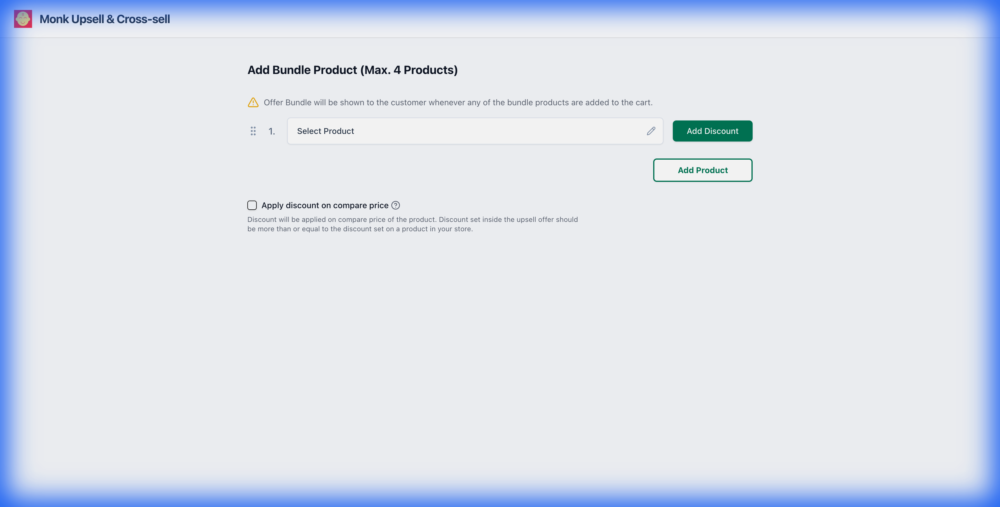

# Monk Upsell & Cross-sell Manager



## Overview

A powerful and intuitive React-based interface designed for e-commerce store owners to manage product bundles, upselling, and cross-selling opportunities. This application provides a seamless experience for selecting products, managing variants, and configuring discount strategies, all wrapped in a modern, responsive design.

The solution ensures efficient workflow management with features like drag-and-drop reordering, real-time validations (preventing duplicates), and a robust product picker.

## Features

- **🛍️ Smart Product Picker**:
  - Search and select products from an extensive catalog.
  - Infinite scroll pagination for smooth browsing.
  - Multi-selection support with clear visual feedback.
- **✨ Interactive List Management**:
  - **Drag-and-Drop**: Reorder products effortlessly using `@dnd-kit`.
  - **Variant Management**: Expand/collapse product details to manage specific variants.
  - **Duplicate Prevention**: Intelligent logic to prevent adding the same product multiple times.
- **🏷️ Discount Configuration**:

  - Apply global or item-specific discounts.
  - Toggle between **Flat** and **Percentage** discount types.

- **🎨 Modern UI/UX**:
  - Built with **Tailwind CSS** for a clean, consistent aesthetic.
  - **Radix UI** primitives for accessible and robust interactive components.
  - Smooth animations with **Framer Motion**.

## Tech Stack

- **Core**: [React](https://react.dev/) (v19), [TypeScript](https://www.typescriptlang.org/)
- **Build Tool**: [Vite](https://vitejs.dev/)
- **Styling**: [Tailwind CSS](https://tailwindcss.com/), [Tailwind Merge](https://github.com/dcastil/tailwind-merge)
- **UI Components**: [Radix UI](https://www.radix-ui.com/), [Lucide React](https://lucide.dev/) (Icons)
- **Drag & Drop**: [@dnd-kit](https://dndkit.com/)
- **Animation**: [Framer Motion](https://www.framer.com/motion/)

## Getting Started

### Prerequisites

Ensure you have the following installed on your machine:

- [Node.js](https://nodejs.org/) (v18 or higher recommended)
- npm (usually comes with Node.js)

### Installation

1. **Clone the repository**

   ```bash
   git clone <your-repo-url>
   cd monk-assignment
   ```

2. **Install dependencies**

   ```bash
   npm install
   ```

3. **Start the development server**

   ```bash
   npm run dev
   ```

   The application will start, typically at `http://localhost:5173`.

## Project Structure

```bash
src/
├── assets/         # Static assets
├── components/     # Reusable UI components (ProductPicker, ProductList, etc.)
├── hooks/          # Custom React hooks
├── lib/            # Utility functions (utils.ts)
├── App.tsx         # Main application component
└── main.tsx        # Entry point
```

## Scripts

- `npm run dev`: Starts the development server with HMR.
- `npm run build`: Compiles the application for production.
- `npm run lint`: Runs ESLint to check for code quality issues.
- `npm run preview`: Locally previews the production build.

## Contributing

1. Fork the project.
2. Create your feature branch (`git checkout -b feature/AmazingFeature`).
3. Commit your changes (`git commit -m 'Add some AmazingFeature'`).
4. Push to the branch (`git push origin feature/AmazingFeature`).
5. Open a Pull Request.
